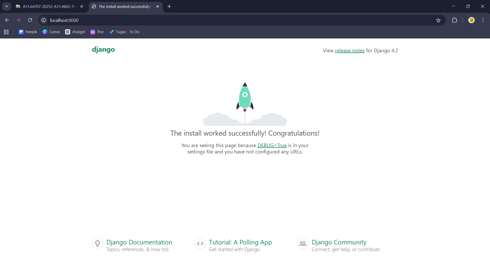
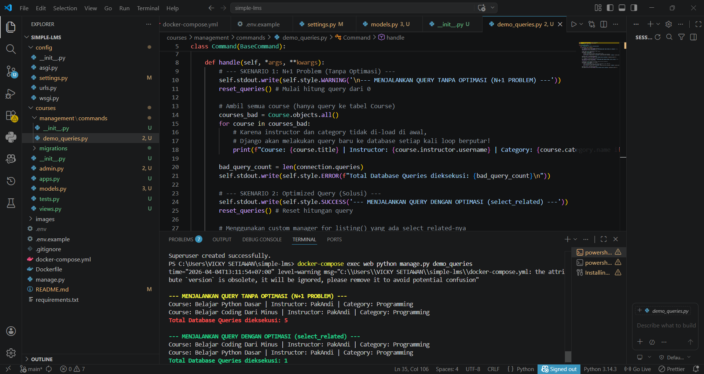

# Simple LMS

**Nama:** Vicky Setiawan
**Repository:** [github.com/VickySetiawan19/simple-lms-docker](https://github.com/VickySetiawan19/simple-lms-docker)

Project ini adalah implementasi Simple LMS menggunakan Django dan PostgreSQL yang dijalankan di dalam container Docker, dilengkapi Redis caching, Celery background tasks, dan MongoDB analytics.

---

## Cara Menjalankan Project

```bash
# 1. Clone repository
git clone https://github.com/VickySetiawan19/simple-lms-docker.git
cd simple-lms

# 2. Copy dan isi environment variables
cp .env.example .env

# 3. Build dan jalankan semua services
docker-compose build
docker-compose up -d

# 4. Jalankan migrasi database
docker-compose exec web python manage.py migrate

# 5. Buat superuser
docker-compose exec web python manage.py createsuperuser
```

**Akses:**
- Django API: http://localhost:8000
- RabbitMQ UI: http://localhost:15672
- Flower (Celery Monitor): http://localhost:5555

---

## Tugas 1: Django ORM & Query Optimization

Project ini telah mengimplementasikan Data Models untuk LMS (User, Category, Course, Lesson, Enrollment, Progress) beserta relasi ForeignKey dan OneToOneField.

**Bukti Optimasi Query (N+1 Problem Solved):**
Membuat custom manager `Course.objects.for_listing()` menggunakan `select_related`. Berikut adalah perbandingan performa query ke database sebelum dan sesudah optimasi:




---

## Tugas 2: Redis Caching Exercise

### Kode yang Dimodifikasi

**Sebelum (Original):**
```python
def get_weather(city):
    """Simulasi API call yang lambat"""
    time.sleep(2)  # Simulate slow API
    response = requests.get(f"https://api.example.com/weather/{city}")
    return response.json()
```

Masalah: setiap pemanggilan `get_weather()` selalu membutuhkan **~2 detik**, bahkan untuk kota yang sama.

**Sesudah (dengan Redis Caching):**
```python
import redis
import json

r = redis.Redis(host='localhost', port=6379, db=0, decode_responses=True)
CACHE_TTL = 300  # 5 menit

def get_weather(city: str) -> dict:
    cache_key = f"weather:{city.lower()}"

    # STEP 1: Cek cache dulu
    cached_data = r.get(cache_key)          # Redis: GET
    if cached_data:
        return json.loads(cached_data)      # return cepat dari cache

    # STEP 2: Cache miss -> call API
    time.sleep(2)
    data = { "city": city, "temperature": 32, ... }

    # STEP 3: Simpan ke cache dengan TTL 5 menit
    r.setex(cache_key, CACHE_TTL, json.dumps(data))  # Redis: SETEX

    return data
```

### Redis Commands yang Digunakan

| Command | Syntax | Kegunaan dalam kode |
|---------|--------|---------------------|
| `GET` | `GET weather:jakarta` | Mengambil data cache yang sudah tersimpan |
| `SETEX` | `SETEX weather:jakarta 300 <json>` | Menyimpan data + set expiry 300 detik sekaligus |
| `TTL` | `TTL weather:jakarta` | Mengecek berapa detik tersisa sebelum key expired |
| `DEL` | `DEL weather:jakarta` | Menghapus cache (dipakai di test setup) |
| `PING` | `PING` | Mengecek apakah Redis berjalan |

> **Catatan:** `SETEX key seconds value` = `SET key value` + `EXPIRE key seconds` dalam satu perintah atomik.

### Hasil Test

```
=======================================================
  REDIS CACHING - WEATHER API TEST
=======================================================

[SETUP] Cache untuk 'Jakarta' dihapus sebelum test.

=======================================================
  CALL #1 - First call (Cache MISS)
=======================================================
  [CACHE MISS] Key 'weather:jakarta' tidak ada. Memanggil API...
  [CACHE SET]  Data disimpan ke Redis. Key: 'weather:jakarta', TTL: 300s

  Data  : {'city': 'Jakarta', 'temperature': 32, 'humidity': 85, ...}
  Waktu : 2.005 detik  <- lambat (hit API)

=======================================================
  CALL #2 - Second call (Cache HIT)
=======================================================
  [CACHE HIT]  Key 'weather:jakarta' ditemukan. Sisa TTL: 300 detik

  Data  : {'city': 'Jakarta', 'temperature': 32, 'humidity': 85, ...}
  Waktu : 0.0039 detik  <- cepat (dari cache)

=======================================================
  SUMMARY
=======================================================

  Kota       | Call | Waktu      | Status
  -----------+------+------------+------------
  Jakarta    | #1   |   2.005s   | CACHE MISS
  Jakarta    | #2   |  0.0039s   | CACHE HIT [OK]
  Bandung    | #3   |   2.005s   | CACHE MISS
  Bandung    | #4   |  0.0034s   | CACHE HIT [OK]

  Speedup: 510x lebih cepat dengan cache!
```

### Jawaban Pertanyaan

**1. Mengapa response time berbeda?**

**Call pertama** (*Cache MISS*): fungsi harus menjalankan seluruh proses — memanggil API eksternal (`time.sleep(2)` mensimulasikan latensi jaringan + pemrosesan server), lalu hasilnya baru disimpan ke Redis.

**Call kedua** (*Cache HIT*): Redis langsung mengembalikan data yang sudah tersimpan dalam memori (RAM). Tidak ada request ke API, tidak ada komputasi berat. Redis adalah **in-memory store** sehingga operasi `GET` bisa selesai dalam **< 1 milidetik**.

> **Analogi:** Seperti mencatat jawaban soal ulangan di kertas contekan. Pertama kali kamu cari di buku (lama), lalu kamu catat jawabannya. Berikutnya, tinggal baca catatanmu (cepat).

**2. Apa keuntungan caching?**

| Keuntungan | Penjelasan |
|---|---|
| **Performa lebih cepat** | Response time turun dari detik ke milidetik (~500x speedup) |
| **Hemat biaya API** | Tidak setiap request harus memanggil API eksternal |
| **Mengurangi beban server** | Database/API tidak dibombardir request yang sama berulang kali |
| **Resiliensi** | Jika API eksternal down sementara, data dari cache masih bisa dilayani |
| **Skalabilitas** | Server bisa melayani lebih banyak user dengan resource yang sama |

**3. Kapan sebaiknya tidak menggunakan cache?**

| Kondisi | Alasan |
|---|---|
| **Data harus selalu real-time** | Contoh: harga saham — cache bisa tampilkan data lama yang tidak akurat |
| **Data bersifat personal/sensitif** | Risiko user A mendapat data cache milik user B |
| **Data sangat jarang diakses** | Overhead cache tidak sebanding jika data hampir tidak pernah dipakai ulang |
| **Data berubah sangat sering** | Jika data berubah lebih cepat dari TTL, cache selalu expired dan tidak efektif |
| **Resource terbatas** | Redis menyimpan data di RAM — bisa menghabiskan memori server |

### Cara Menjalankan Redis Exercise

```bash
# 1. Jalankan Redis
docker run -d -p 6379:6379 --name redis-cache redis:7-alpine

# 2. Install dependency
pip install redis

# 3. Jalankan test
cd redis_exercise
python test_cache.py
```

Atau gunakan Redis dari docker-compose project ini:

```bash
docker-compose up -d redis
python redis_exercise/test_cache.py
```