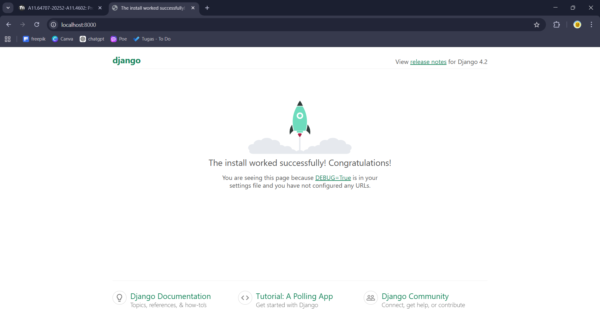
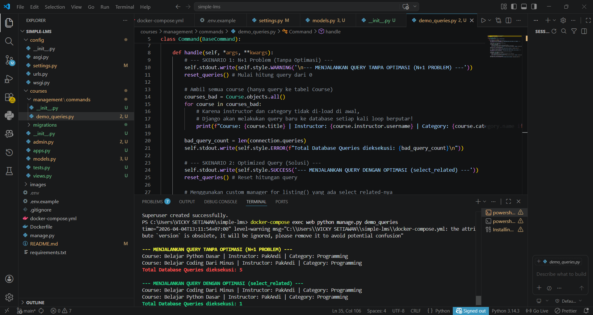

# Simple LMS — Extended Backend

**Nama:** Vicky Setiawan
**Repository:** [github.com/VickySetiawan19/simple-lms-docker](https://github.com/VickySetiawan19/simple-lms-docker)

Project ini adalah implementasi **Simple Learning Management System** menggunakan Django + Django Ninja, dilengkapi dengan:
- **PostgreSQL** sebagai database utama
- **Redis** untuk caching
- **MongoDB** untuk activity logging & analytics
- **Celery + RabbitMQ** untuk background task processing
- **Flower** untuk monitoring Celery tasks
- **JWT Authentication** dengan Role-Based Access Control (RBAC)

---

## Arsitektur Sistem

```
                    ┌─────────────────┐
                    │   Client/User   │
                    └────────┬────────┘
                             │ HTTP
                    ┌────────▼────────┐
                    │   Django Ninja  │
                    │   REST API      │
                    │   (Port 8000)   │
                    └──┬──┬──┬──┬─────┘
                       │  │  │  │
          ┌────────────┘  │  │  └────────────┐
          ▼               ▼  ▼               ▼
   ┌──────────┐   ┌──────────┐   ┌───────────────┐
   │PostgreSQL│   │  Redis   │   │   RabbitMQ     │
   │(Database)│   │ (Cache)  │   │  (Broker)      │
   │ Port 5432│   │Port 6379 │   │ Port 5672      │
   └──────────┘   └──────────┘   │ UI: 15672      │
                                 └───────┬────────┘
                                         │
                                 ┌───────▼────────┐
                                 │ Celery Worker   │
                                 │ (Background     │
                                 │  Tasks)         │
                                 └───────┬────────┘
                                         │
                           ┌─────────────┼─────────────┐
                           ▼             ▼             ▼
                    ┌──────────┐  ┌──────────┐  ┌──────────┐
                    │ MongoDB  │  │  Email    │  │ Flower   │
                    │(Analytics│  │ (SMTP)   │  │(Monitor) │
                    │Port 27017│  │          │  │Port 5555 │
                    └──────────┘  └──────────┘  └──────────┘
```

---

## Cara Menjalankan Project

### Prerequisites
- Docker & Docker Compose

### Langkah-langkah

```bash
# 1. Clone repository
git clone https://github.com/VickySetiawan19/simple-lms-docker.git
cd simple-lms

# 2. Copy environment variables
cp .env.example .env

# 3. Build dan jalankan semua services
docker-compose build
docker-compose up -d

# 4. Jalankan migrasi database
docker-compose exec web python manage.py migrate

# 5. Load demo data (akun, course, enrollment)
docker-compose exec web python manage.py seed_data
```

### Akses Services

| Service | URL | Keterangan |
|---------|-----|------------|
| Django API | http://localhost:8000 | REST API |
| Swagger/OpenAPI | http://localhost:8000/api/docs | Dokumentasi API interaktif |
| Django Admin | http://localhost:8000/admin | Admin panel |
| RabbitMQ UI | http://localhost:15672 | Message broker (guest/guest) |
| Flower | http://localhost:5555 | Celery task monitoring |

---

## Akun Demo

| Username | Password | Role | Keterangan |
|----------|----------|------|------------|
| `admin` | `admin123` | Admin | Full access, superuser |
| `instructor1` | `instructor123` | Instructor | Pemilik 3 courses |
| `instructor2` | `instructor123` | Instructor | Pemilik 2 courses |
| `student1` | `student123` | Student | Enrolled 3 courses |
| `student2` | `student123` | Student | Enrolled 2 courses |

---

## Endpoint API

### Auth (`/api/auth/`)

| Method | Endpoint | Auth | Role | Deskripsi |
|--------|----------|------|------|-----------|
| POST | `/api/auth/register` | ❌ | - | Register pengguna baru |
| POST | `/api/auth/login` | ❌ | - | Login, dapatkan JWT token |
| POST | `/api/auth/refresh` | ❌ | - | Refresh access token |
| GET | `/api/auth/me` | ✅ | Any | Profil user yang login |
| PUT | `/api/auth/me` | ✅ | Any | Update profil |

### Courses (`/api/courses/`)

| Method | Endpoint | Auth | Role | Deskripsi |
|--------|----------|------|------|-----------|
| GET | `/api/courses` | ❌ | - | List courses (pagination, filter) |
| GET | `/api/courses/{id}` | ❌ | - | Detail course + lessons |
| POST | `/api/courses` | ✅ | Instructor | Buat course baru |
| PATCH | `/api/courses/{id}` | ✅ | Owner/Admin | Update course |
| DELETE | `/api/courses/{id}` | ✅ | Admin | Hapus course |

### Lessons (`/api/lessons/`)

| Method | Endpoint | Auth | Role | Deskripsi |
|--------|----------|------|------|-----------|
| GET | `/api/lessons/{course_id}` | ❌ | - | List lessons di course |
| POST | `/api/lessons/{course_id}` | ✅ | Instructor | Buat lesson baru |
| PATCH | `/api/lessons/{id}/update` | ✅ | Owner/Admin | Update lesson |
| DELETE | `/api/lessons/{id}/delete` | ✅ | Admin | Hapus lesson |

### Enrollments (`/api/enrollments/`)

| Method | Endpoint | Auth | Role | Deskripsi |
|--------|----------|------|------|-----------|
| POST | `/api/enrollments` | ✅ | Student | Enroll ke course (trigger email async) |
| GET | `/api/enrollments/my-courses` | ✅ | Any | List course yang diikuti |
| POST | `/api/enrollments/{id}/progress` | ✅ | Any | Tandai lesson selesai (auto certificate) |

### Tasks (`/api/tasks/`) — *Paket 6*

| Method | Endpoint | Auth | Role | Deskripsi |
|--------|----------|------|------|-----------|
| POST | `/api/tasks/export-report` | ✅ | Admin | Trigger async export CSV |
| POST | `/api/tasks/generate-certificate` | ✅ | Instructor | Trigger manual certificate |
| GET | `/api/tasks/{task_id}/status` | ✅ | Any | Cek status async task |

---

## Fitur Tambahan: Paket 6 — Async Processing & Notification

### 1. Email Notification Async (12 Poin)

Saat student enroll ke course, sistem mengirim email konfirmasi secara **async** melalui Celery worker. Email dikirim sebagai background task sehingga tidak memperlambat response API.

**Implementasi:** `courses/tasks.py` → `send_enrollment_email` dipanggil via `.delay()` di endpoint enroll.

### 2. Generate Certificate/Report Async (18 Poin)

- **Certificate otomatis:** Saat student menyelesaikan semua lesson, sistem otomatis trigger `generate_certificate` task.
- **Export report:** Admin bisa trigger `export_course_report` untuk generate CSV enrollment report secara async.

**Implementasi:** `courses/tasks.py` → `generate_certificate`, `export_course_report`

### 3. Scheduled Tasks — Celery Beat (15 Poin)

3 scheduled tasks berjalan otomatis:

| Task | Jadwal | Fungsi |
|------|--------|--------|
| `update_enrollment_statistics` | Setiap jam | Update jumlah enrollment per course |
| `cleanup_expired_data` | Setiap hari jam 02:00 | Hapus expired sessions |
| `sync_learning_analytics` | Setiap 6 jam | Sync progress ke MongoDB |

**Konfigurasi:** `config/celery.py` → `app.conf.beat_schedule`

### 4. Task Status Endpoint (12 Poin)

User dapat mengecek status background task yang sedang berjalan melalui:
```
GET /api/tasks/{task_id}/status
```
Response:
```json
{
    "task_id": "abc-123-def",
    "status": "SUCCESS",
    "result": {"rows": 25, "filename": "report_20260630.csv"}
}
```

Status values: `PENDING`, `STARTED`, `SUCCESS`, `FAILURE`, `RETRY`

### 5. Flower Monitoring (8 Poin)

Flower berjalan sebagai service terpisah di Docker Compose pada port `5555`:
- Akses: http://localhost:5555
- Monitoring: Task list, worker status, task detail, graphs
- Berguna untuk debugging dan memantau performa worker

---

## Cara Test Celery Tasks

```bash
# 1. Pastikan semua service running
docker-compose up -d

# 2. Cek worker aktif
docker-compose logs celery-worker

# 3. Cek scheduled tasks
docker-compose logs celery-beat

# 4. Test via API:
#    a. Login sebagai student
#    b. Enroll ke course → cek log worker (email task)
#    c. Mark semua lesson complete → cek log worker (certificate task)
#    d. Login sebagai admin → trigger export report → cek status

# 5. Monitor di Flower
# http://localhost:5555
```

---

## Tugas 1: Django ORM & Query Optimization

Project ini mengimplementasikan Data Models LMS (User, Category, Course, Lesson, Enrollment, Progress) beserta relasi ForeignKey dan OneToOneField.

**Bukti Optimasi Query (N+1 Problem Solved):**
Custom manager `Course.objects.for_listing()` menggunakan `select_related`.




---

## Tugas 2: Redis Caching Exercise

### Redis Commands yang Digunakan

| Command | Syntax | Kegunaan |
|---------|--------|----------|
| `GET` | `GET weather:jakarta` | Mengambil cache |
| `SETEX` | `SETEX weather:jakarta 300 <json>` | Menyimpan + expiry |
| `TTL` | `TTL weather:jakarta` | Cek sisa TTL |
| `DEL` | `DEL weather:jakarta` | Hapus cache |
| `PING` | `PING` | Cek Redis hidup |

### Cara Menjalankan Redis Exercise

```bash
docker-compose up -d redis
cd redis_exercise
pip install redis
python test_cache.py
```

---

## Tech Stack

| Komponen | Teknologi | Versi |
|----------|-----------|-------|
| Backend | Django + Django Ninja | 4.2 + 1.1.0 |
| Database | PostgreSQL | 15 |
| Cache | Redis | 7 |
| Message Broker | RabbitMQ | 3.13 |
| Task Queue | Celery | 5.3.6 |
| Analytics DB | MongoDB | 7 |
| Monitoring | Flower | latest |
| Container | Docker Compose | 3.8 |